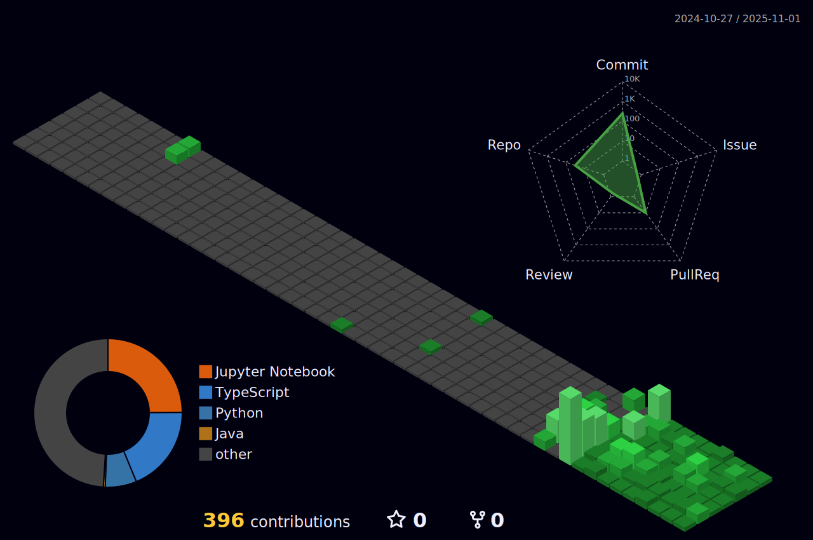

<!-- Última actualización: 2025-08-29 01:19:55 UTC -->

<!-- Mensaje bienvenida -->
<h1 align="center">
  
</h1>
<h2 align="center">Hi there 👋, I'm Khoa!</h2>

###

###

<!-- Stats generales -->

  

###

>[!NOTE]
> 📝 Below this note, I will list all the programming languages and technologies I've used in my life so far.

<!-- Lenguajes, Herramientas y Plataformas -->
<!-- 🖥️ Programming Languages -->
<h3 align="center">🖥️ Programming Languages</h3>

  

<!-- 🗄️ Databases & Backend -->
<h3 align="center">🗄️ Databases & Backend</h3>

  

<!-- ⚙️ DevOps & Cloud -->
<!-- ⚙️ DevOps & Cloud -->
<h3 align="center">⚙️ DevOps & Cloud</h3>

  
  
  

<!-- 🧰 OS & Tools -->
<h3 align="center">🧰 OS & Tools</h3>

  

###

<!-- Grafico de actividad GitHub -->

###

<!-- Contribuciones 3D GitHub -->

###

<!-- Snake Animation con enlace a Platane/snk -->

###

<!-- Contador de visitas -->

  

###

<!-- Footer SVG -->

