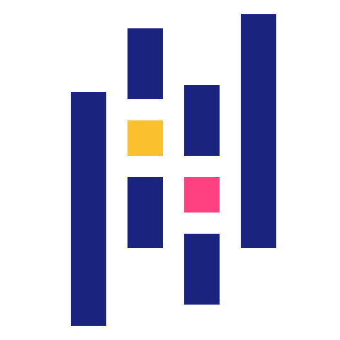
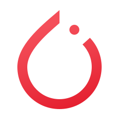

<!-- Última actualización: 2025-12-31 01:11:17 UTC -->
<p>
    
</p>

<!--- Adding Header Elements -->
<p align="center">
    <a href="https://linkedin.com/in/cao-khoa-1b09141b8">
        
    </a>&nbsp;&nbsp;&nbsp;&nbsp;
    <a href="https://stackoverflow.com/users/23644108">
        
    </a>&nbsp;&nbsp;&nbsp;&nbsp;
    <a href="https://facebook.com/caokhoa.140">
        
    </a>&nbsp;&nbsp;&nbsp;&nbsp;
    <a href="https://instagram.com/caokhoa298">
        
    </a>&nbsp;&nbsp;
    <a href="https://mail.google.com/mail/?view=cm&to=godminhkhoa@gmail.com">
        

</p>


<div align="justify" style="font-size: 1.6em; line-height: 1.8;">
  <p>
    👋 Hello! My name is <b>Cao Lê Minh Khoa</b>, a Computer Science student at 
    <b>Ho Chi Minh City University of Technology (HCMUT)</b>. With a strong passion for technology, 
    I am striving to become both an <b>AI Engineer</b> and a <b>DevOps Specialist</b>.
  </p>

  <p>
    🔬 My research interests include <b>Computer Vision</b>, <b>Natural Language Processing</b>, 
    <b>Large Language Models</b>, and <b>Generative AI</b>. I am fascinated by how these fields 
    blend mathematics, engineering, and creativity to solve real-world problems.
  </p>

  <p>
    🚀 I aspire to bridge the gap between <b>AI research</b> and <b>production-ready systems</b>. 
    For me, it is not only about developing intelligent models, but also about building reliable 
    infrastructures using <b>cloud computing</b>, <b>CI/CD pipelines</b>, and <b>container orchestration</b> 
    that can scale to millions of users.
  </p>

  <p>
    💡 Beyond academics, I enjoy contributing to open-source projects, exploring new frameworks, 
    and documenting my learning journey. My long-term vision is to grow as a versatile engineer, 
    actively engage with the global AI community, and create impactful innovations driven by 
    persistence, curiosity, and creativity.
  </p>
</div>


<br>

<!-- [](https://github.com/khoalearningcode/github-profile-trophy) -->


**💻Tech Stack:**<br><br>
<p>
<b>Languages:</b>&nbsp;&nbsp;&nbsp;
    &nbsp;&nbsp;
    &nbsp;&nbsp;
    &nbsp;&nbsp;
    <br><br><br>
<b>Libraries & Frameworks:</b>&nbsp;&nbsp;&nbsp;
    &nbsp;&nbsp;
    &nbsp;&nbsp;
    &nbsp;&nbsp;
    &nbsp;&nbsp;
    &nbsp;&nbsp;
    &nbsp;&nbsp;
    &nbsp;&nbsp;
    <br><br><br>
    <b>Tools & Platforms:</b>&nbsp;&nbsp;&nbsp;
    &nbsp;&nbsp;
    &nbsp;&nbsp;
    &nbsp;&nbsp;
    &nbsp;&nbsp;
    <br><br><br>
    &nbsp;&nbsp;&nbsp;<b>Databases :</b>&nbsp;&nbsp;&nbsp;
</p><br><br>

<h2 style="color:#1E90FF; display: flex; align-items: center;">
    <a href="https://leetcode.com/u/godminhkhoa/" style="display: inline-flex; align-items: center; text-decoration: none;">
        </a>
        <span style="color:#1E90FF; font-size: 1.5em; vertical-align: middle;">LeetCode Stats:</span>
</h2>

<p>
    <a href="https://leetcode.com/u/godminhkhoa/">
    
    </a>
</p>

<h2 style="color:#1E90FF; display: flex; align-items: center;">
    <a href="https://github.com/khoalearningcode" style="display: inline-flex; align-items: center; text-decoration: none;">
        </a>
        <span style="color:#1E90FF; font-size: 1.5em; vertical-align: middle;">GitHub Stats:</span>
    
</h2>
<p>
    <br>
    <br>
    <br>
    
    
    <p align="center"></p>
    <br>
    
</p>

<!-- Contador de visitas -->
<p align="center">
  <a href="https://count.getloli.com/" target="_blank">
    
  </a>
</p>

<div align="center">
  <h3 style="color:#e8df7a;">✍️ Random Dev Quote</h3>
  
</div>

<hr>


<div align="center">

```diff
+@ @ @ @ @ @ @ @ @ @ @ @ @ @ @ @ @ @ @ @ @ @ @ @ @ @ @ @+
@@       o o                                           @@
@@       | |                                           @@
@@      _L_L_                                          @@
@@   ❮\/__-__\/❯  A habit missed once is a mistake,    @@
@@   ❮(|~o.o~|)❯    A habit missed twice is a start    @@
@@   ❮/ \`-'/ \❯          of new habit!                @@
@@     _/`U'\_                                         @@
@@    ( .   . )     .----------------------------.     @@
@@   / /     \ \    | while( ! (succed=try() ) ) |     @@
@@   \ |  ,  | /    '----------------------------'     @@
@@    \|=====|/                                        @@
@@     |_.^._|                                         @@
@@     | |"| |                                         @@
@@     ( ) ( )   Testing leads to failure              @@
@@     |_| |_|   and failure leads to understanding    @@
@@ _.-' _j L_ '-._                                     @@
@@(___.'     '.___)                                    @@
+@ @ @ @ @ @ @ @ @ @ @ @ @ @ @ @ @ @ @ @ @ @ @ @ @ @ @ @+
```
  
</div>

&nbsp;&nbsp;&nbsp;&nbsp;&nbsp;&nbsp;&nbsp;&nbsp;&nbsp;&nbsp;&nbsp;&nbsp;&nbsp;&nbsp;&nbsp;&nbsp;&nbsp;&nbsp;&nbsp;&nbsp;&nbsp;&nbsp;&nbsp;&nbsp;&nbsp;&nbsp;&nbsp;&nbsp;&nbsp;&nbsp;&nbsp;&nbsp;&nbsp;&nbsp;&nbsp;&nbsp;&nbsp;&nbsp;&nbsp;&nbsp;&nbsp;&nbsp;&nbsp;&nbsp;&nbsp;&nbsp;&nbsp;&nbsp;&nbsp;&nbsp;&nbsp;&nbsp;&nbsp;&nbsp;&nbsp;&nbsp;&nbsp;&nbsp;&nbsp;&nbsp;&nbsp;&nbsp;&nbsp;&nbsp;&nbsp;&nbsp;&nbsp;&nbsp;&nbsp;&nbsp;&nbsp;&nbsp;&nbsp;&nbsp;&nbsp;&nbsp;&nbsp;&nbsp;&nbsp;&nbsp;&nbsp;&nbsp;&nbsp;&nbsp;&nbsp;&nbsp;&nbsp;&nbsp;&nbsp;&nbsp;&nbsp;&nbsp;&nbsp;&nbsp;&nbsp;&nbsp;&nbsp;&nbsp;&nbsp;&nbsp;&nbsp;&nbsp;&nbsp;&nbsp;&nbsp;&nbsp;&nbsp;&nbsp;&nbsp;&nbsp;&nbsp;&nbsp;

